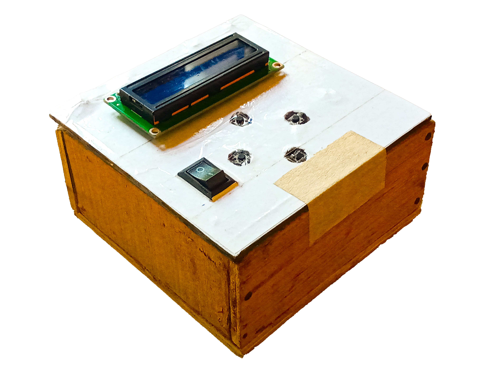
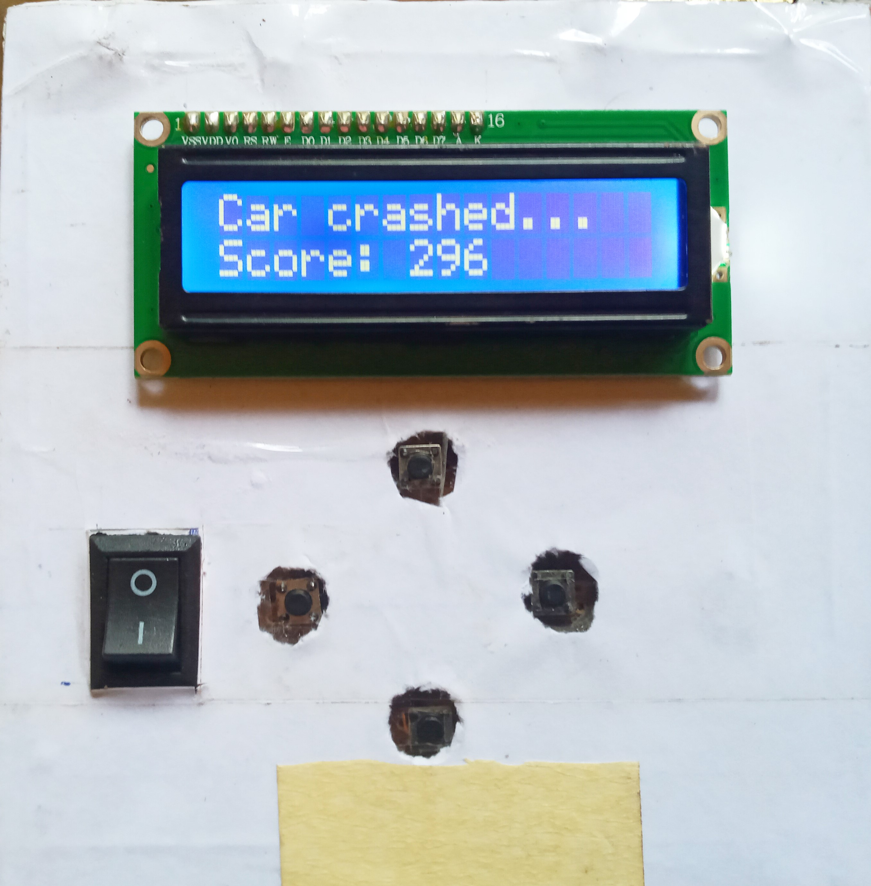

# 🚗 Mini Car Game

A simple, real-time game built using the **ATmega328P microcontroller**. The game runs on a 16x2 LCD display and challenges players to dodge randomly generated obstacles by moving a car up and down using push buttons.

---

## 🎮 Features

- Developed on **ATmega328P** microcontroller (AVR C)
- Displayed on **16x2 character LCD** via I2C
- Car controlled using **push buttons**
- **Random obstacle generation** using PRNG
- **Collision detection** and real-time updates
- **Score calculation** based on survival time
- Difficulty increases as the game progresses
- Powered by a **9V battery** via a **buck converter**

---

## 🧰 Hardware Components

- ATmega328P Microcontroller  
- 16x2 LCD Display (with I2C module)  
- Push Buttons (Up, Down, Start)  
- Custom PCB (designed using EasyEDA)  
- 9V Battery + Buck Converter  
- Wooden Box  
- Jumper Wires, Resistors

---

## 🕹️ Gameplay Overview

1. Game begins with a countdown.
2. Player controls a car (displayed as `>`) using UP and DOWN buttons.
3. Random obstacles (`O`) scroll from right to left on the LCD.
4. The goal is to avoid obstacles by switching between the two rows.
5. A collision ends the game and displays the score.
6. Score is based on how long the player survives.

---

## 🛠️ How to Run

1. **Program the ATmega328P** with the provided C code using an AVR programmer.
2. **Assemble the hardware**
3. Connect:
   - LCD to I2C (SDA to PC4, SCL to PC5)
   - Push buttons to PD2, PD3, PD4, and PD5
4. Power the device using a 9V battery with a 5V buck converter.
5. Press Start (left or right button) to begin.

---

## 📸 Gallery

---

